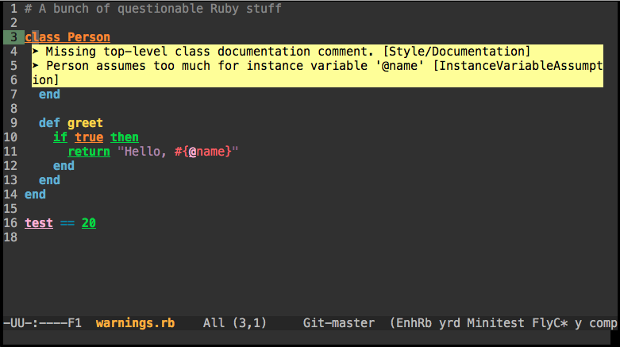

# flycheck-popup-tip

[](https://github.com/Simplify/flycheck-popup-tip/blob/master/COPYING)

This is extension for [Flycheck](http://www.flycheck.org/). It implements minor-mode for displaying errors from Flycheck using [popup.el](https://github.com/auto-complete/popup-el).



There is [official flycheck-pos-tip](https://github.com/flycheck/flycheck-pos-tip) extension for displaying errors under point. However, it does not display popup if you run Emacs under TTY. Also popups made by `pos-tip` library does not always look good, especially on macOS.

## Installation

### Melpa

Package is not yet available on [Melpa](https://melpa.org/).

### Manual

Download `flycheck-popup-tip.el` and load it in your `init.el`:

``` elisp
(add-to-list 'load-path "/path-to-directory-where-you-put-downloaded-file/")
(load-library "flycheck-popup-tip")
(eval-after-load 'flycheck
  (progn
    (require 'flycheck-popup-tip)
    (flycheck-popup-tip-mode)))
```

## Configuration options

There is only one configuration option, `flycheck-popup-tip-error-prefix`.
Default value is "\u27a4 ": `➤ `.

```cl
(custom-set-variables
 '(flycheck-popup-tip-error-prefix "* "))
```

## Usage with `flycheck-pos-tip`

If you are planning to use `flycheck-pos-tip` with GUI Emacs and this extension on TTY, you can do it with following configuration:

``` elisp
(eval-after-load 'flycheck
  (if (display-graphic-p)
      (flycheck-pos-tip-mode)
    (flycheck-popup-tip-mode)))
```

## License

This program is free software: you can redistribute it and/or modify it under
the terms of the GNU General Public License as published by the Free Software
Foundation, either version 3 of the License, or (at your option) any later
version.

This program is distributed in the hope that it will be useful, but WITHOUT ANY
WARRANTY; without even the implied warranty of MERCHANTABILITY or FITNESS FOR A
PARTICULAR PURPOSE.  See the GNU General Public License for more details.

You should have received a copy of the GNU General Public License along with
this program.  If not, see http://www.gnu.org/licenses/.
